# Abstract

We specify a reproducible advanced literature-review workflow for rapidly changing
domains in which a single query does not adequately represent methodological or
temporal variation. The exemplar is configured for exoplanet atmospheric composition
and separates foundation, James Webb Space Telescope, and molecular-detection phases.

The design is informed by systematic-review reporting practice [@page2021prisma], but
this repository release is a methods exemplar rather than a completed systematic review:
its default corpus is synthetic and its phase boundaries, search coverage, and domain
interpretation require review for any live application.

The pipeline combines multi-engine retrieval, canonical de-duplication, deterministic
screening, optional LLM-assisted classification, full-text assessment, bibliometrics,
knowledge-graph construction, visualization, reproducibility assessment, and export.
Each stage has a declared input, output, method reference, and definition of done in
`methods_pipeline.yaml`. The numbered scripts are thin adapters; reusable computation
is tested in `src/`.

The manuscript is generated from configuration and recorded artifacts. Offline runs use
a clearly labelled synthetic fixture corpus with reserved identifiers and generated
authors; they exercise pipeline behavior and are not evidence about exoplanet atmospheres.
Live runs
must retain retrieval reports, source provenance, claim classifications, and the exact
configuration needed to interpret reported results.

The contribution is therefore infrastructural: it makes phase-aware search design,
evidence boundaries, accessibility metadata, and reproducibility checks explicit while
leaving domain claims subject to source-backed review.

**Keywords:** exoplanet atmospheres, literature review pipeline, systematic-review reporting, multi-phase search, LLM filtering, James Webb Space Telescope, atmospheric composition, transit spectroscopy, bibliometrics, cross-validation


---


# Introduction

Rapidly changing fields require literature reviews that preserve the distinction
between what was searched, what was retrieved, what was assessed, and what can be
claimed. A single broad query hides phase-specific coverage and makes it difficult to
explain how records entered a synthesis. This project treats a literature review as a
reproducible data pipeline: configuration defines the review design, source adapters
acquire records, analysis modules produce evidence artifacts, and rendering turns
those artifacts into an auditable manuscript.

The reporting surface follows the spirit of systematic-review transparency
[@page2021prisma] without implying that the bundled fixture satisfies a domain
protocol. A live review must define eligibility criteria, search dates, source
coverage, screening procedures, and a domain-appropriate synthesis plan before its
results are interpreted.

The bundled configuration targets **Exoplanet Atmospheres**. It defines three ordered
phases for foundational methods, JWST-era observations, and molecular detection. The
phase labels are configuration, not conclusions: a live review must justify its
boundaries and update its claim ledger when the domain or search strategy changes.

## Research Questions

1. **Coverage and retrieval.** Which engines, queries, filters, and identifiers
   contributed records to each phase, and where are the known coverage limits?
2. **Structure.** How do subfields, topics, authors, venues, and citation links vary
   across the configured phases?
3. **Evidence.** Which claims are supported by source-backed records, which remain
   pending, and which are only properties of the synthetic fixture?
4. **Reproducibility.** Can a clean run regenerate the data, figures, reports, and
   manuscript without unexplained differences?

## Scope and contribution

The project contributes a reusable workflow rather than a domain conclusion. Retrieval
and de-duplication preserve source observations; full-text assessment records access
status; bibliometrics and graph construction expose descriptive structure; and the
claim ledger separates fixture, configured, and source-backed statements. Subjective
editorial, scientific, and visual judgments remain explicit review items even when all
deterministic gates pass.

Every generated number in the rendered manuscript must come from an artifact listed in
the manifest and be traceable to the relevant method stage. Missing, stale, or
misclassified evidence is a release finding, not a value to be filled by hand.


---


# Methods Overview

The project is an eleven-stage, file-system-backed pipeline. `methods_pipeline.yaml`
is the executable contract: each stage names its method, dependencies, inputs, outputs,
definition of done, and stable failure code. Business logic lives in tested `src/`
modules; numbered scripts only perform bootstrapping, argument parsing, orchestration,
and boundary I/O.

## Pipeline stages

1. **Multi-phase retrieval** (`01_multi_phase_search.py`) acquires records or runs the
   labelled offline fixture, applies configured filters, de-duplicates identifiers, and
   writes phase corpora plus `phase_metadata.json` and the
   `phase_artifact_manifest.json` phase-to-artifact provenance map.
2. **Corpus analysis** (`02_meta_analysis_pipeline.py`) computes subfields, temporal
   trends, TF-IDF/topics, and citation-network artifacts.
3. **Knowledge graph construction** (`03_build_knowledge_graph.py`) optionally extracts
   assertions and phase-aware hypothesis evidence; disabled or unmeasured LLM outputs
   remain explicitly pending.
4. **Visualization** (`04_generate_figures.py`) renders figures from analysis artifacts
   and records each figure's label, caption, filename, and generating stage in the
   figure registry.
5. **Manuscript hydration** (`05_inject_variables.py`) computes variables from outputs
   and writes rendered Markdown without changing source sections.
6. **Full-text assessment** (`06_fulltext_assessment.py`) records abstract, open-access,
   and PDF availability; downloading is opt-in and network-gated.
7. **Literature evaluation** (`07_literature_evaluation.py`) applies configured quality
   and fixture-honesty checks.
8. **Research dispatch** (`08_deep_research_dispatch.py`) replays a recorded report by
   default and exposes live provider dispatch only as an explicit opt-in.
9. **Bibliography export** (`09_export_bibliography.py`) writes a deterministic
   bibliography from the retained corpus and source references.
10. **Reproducibility assessment** (`10_reproducibility_assessment.py`) records workflow
    and source-consumption evidence.
11. **Publication validation** (`11_validate_outputs.py`) validates artifact, evidence,
    figure, and report contracts before the shared publication audit runs.

## Reproducibility model

The offline path uses a deterministic synthetic fixture with reserved identifiers and
generated authors. It is useful for CI and structural testing only; it is never a
substitute for a representative live review. A live run must preserve the retrieval
report, engine status, source identifiers, configuration, and claim classifications.
Seeds and timestamp-free serializers are used where the pipeline supports exact replay.

## Configuration surface

`manuscript/config.yaml` owns search terms, engines, phase boundaries, filters, sampling
seeds, full-text policy, embedding settings, knowledge-graph settings, hypotheses, and
subfield taxonomy. `domain_profile.yaml` owns package and gate expectations;
`experiment_plan.yaml` records the review design; `data/claim_ledger.yaml` records the
provenance tier and fixture/synthetic status of manuscript-facing claims.


---


# Retrieval and De-duplication

Retrieval dispatches the configured query across 4 independent literature
engines (arXiv, OpenAlex, Semantic Scholar, and Crossref). Each engine is an isolated adapter exposing a uniform
`search(query) -> list[Record]` interface; engines that are keyless — arXiv, OpenAlex
[@priem2022openalex], Crossref [@hendricks2020crossref], PubMed/Entrez
[@sayers2022entrez], SovietRxiv / RussiaRxiv, ChinaRxiv, Europe PMC, and bioRxiv/medRxiv —
need no credentials, while Semantic Scholar [@kinney2023semantic] uses a key when present.
SovietRxiv is a translated archive of Soviet-era scientific preprints sourced from
Math-Net.Ru and CyberLeninka [@sovietrxiv]; ChinaRxiv serves translated Chinese preprints
from ChinaXiv via the same unified API. Both retain original-language PDFs alongside each
translation, and their polite rate-limit pool (300/min vs 30/min anonymous) is activated
by an optional `X-API-Email` header. Europe PMC is a keyless biomedical aggregator
covering PubMed, PMC, patents, and preprints in a single search call. bioRxiv/medRxiv
share one unified date-window + cursor API; unlike the other engines it is not a
free-text search endpoint, so the adapter walks the date window page by page and
keeps only records whose title and abstract match every query term client-side.
Optional full-text resolution queries Unpaywall
[@piwowar2018state] for open-access locations. **Multiple dispatch degrades gracefully**:
an engine that is disabled in the configuration, lacks a required key, or cannot reach
the network returns a *skipped* status, and the run completes from the remaining engines
plus the committed offline corpus.

## Engine Details

Each engine adapter follows a uniform contract: a module-level API URL constant, a pure
`_parse_*` parser function, and a `search_*` entry point with pagination, retry, and
graceful error handling. All functions accept an injectable `base_url` parameter for
hermetic testing with `pytest-httpserver` — no engine hardcodes its URL inside the
function body.

| Engine | Rate limit | Pagination | Auth |
| --- | --- | --- | --- |
| arXiv | 3s between requests | 100/page, offset | Keyless |
| Semantic Scholar | 1 req/s (unauth.) | 100/page, offset | Optional key |
| OpenAlex | Polite pool (mailto) | 200/page, cursor | Keyless |
| Crossref | Polite pool (mailto) | 1,000/page, offset | Keyless |
| PubMed | NCBI usage policy | retstart/retmax | Keyless |
| SovietRxiv | 30/min (300/min polite) | 1–100/page, cursor | `X-API-Email` |
| ChinaRxiv | 30/min (300/min polite) | 1–100/page, cursor | `X-API-Email` |
| Europe PMC | ~10 req/s (undocumented hard limit) | Up to 1,000/page | Keyless |
| bioRxiv/medRxiv | No documented limit | 100/page fixed, cursor | Keyless |

Every new search writes `output/data/retrieval_report.json`, a timestamp-free report
that records each attempted, skipped, or failed source with fetched, new-record, and
duplicate counts. A zero-result response is therefore distinguishable from a disabled
adapter or an HTTP failure. The committed corpus predates that report contract, so this
paper intentionally does not reconstruct source-specific counts from the merged corpus.

## Canonical Identifier Hierarchy

Heterogeneous records are reconciled by a **canonical identifier hierarchy** —
DOI $>$ arXiv ID $>$ Semantic Scholar ID $>$ OpenAlex ID $>$ a stable digest of the
normalized title. When two records share a canonical identifier they are merged, keeping
the version with the most complete metadata (a count of non-None optional fields). The
DOI is normalized: case-folded, resolver-prefix stripped, so the same paper returned by
two engines under case/format-variant DOIs merges. For this run, 46 records
carry DOIs, 5 carry OpenAlex IDs, and 0 carry arXiv
IDs. The de-duplicated corpus for this run holds $N = 46$ records published
across 2010--2023.

## Relevance Filtering

After de-duplication, a relevance filter drops papers whose title and abstract contain
none of the configured relevance keywords (exoplanet, atmosphere, transit spectroscopy, JWST, molecular detection, atmospheric composition). Keywords are matched
case-insensitively; an empty keyword list is treated as no filter to avoid silently
wiping the corpus. A year filter then excludes papers published before the configured
start year (2010).


---


# Full Text, Language, and Embeddings

Beyond bibliographic metadata, the pipeline mines the textual content of each record.
This stage bridges the gap between a bibliographic inventory and a semantic
understanding of the literature.

## Full-Text Availability

An open-access resolver maps each record to a downloadable PDF where one exists (a known
`pdf_url`, or an Unpaywall lookup by DOI), and an opt-in, network-gated downloader fetches
it to a deterministic path. Full-text availability is summarized without requiring any
download, so the offline default still reports coverage. For this run:

- **Abstract coverage**: 100.0\% of records (46 of
  46) carry an abstract; 0 records lack one.
- **Open-access status**: 43.5\% of records are open access (20 records);
  the remainder are closed or unknown.
- **PDF availability**: 43.5\% of records (20) have a direct
  PDF link; 20 have a publisher PDF, and 26 have
  no full-text source available.

The identifier coverage for this corpus is: 46 DOIs, 5
OpenAlex IDs, and 0 arXiv IDs. DOI coverage dominates and supports
cross-engine de-duplication.

## Language and Entity Extraction

Titles, abstracts, and (when present) full text are tokenized and reduced to keyphrases
and named entities by offline, dependency-light extractors — no mandatory LLM.
Term-frequency statistics drive a TF-IDF representation over a 137-feature
vocabulary. The most frequent terms in the corpus are: atmospheric, uncertainty, spectra, temperature, abundance, coverage, opacity, sources, analysis, assumptions, observed, retrievals, models, stellar, across, evaluated, retrieval, structure, composition, jwst. These terms
reflect the configured domain and the records retained by the retrieval and filtering
policy; fixture-derived terms are not evidence about the live field.

## Embeddings

Every title, abstract, and full text is embedded into a shared vector space by a
deterministic, offline method — TF-IDF followed by truncated SVD, i.e. latent semantic
analysis [@deerwester1990indexing]. The embedding dimensionality is 50 components (configurable
via `project_config.embeddings.n_components`), and the TF-IDF vocabulary is capped at
137 features (configurable via `project_config.embeddings.max_features`).
The embedding is byte-stable across runs: the same input text always yields identical
vectors, so the derived similarity matrix, nearest-neighbour lists, clusters, and
two-dimensional projection are all reproducible.

An optional transformer backend can be enabled by setting
`project_config.embeddings.method: transformer` (requires the `embeddings` extra), which
upgrades the embedding fidelity without changing the interface or downstream analysis.

The embeddings support semantic retrieval over the corpus and feed two visualizations:
a PCA two-dimensional projection ((Figure pca embeddings)) that maps the topical
geography of the literature, and a hierarchical clustering dendrogram
((Figure dendrogram)) that reveals the similarity structure of the document collection.


---


# Bibliometric and Temporal Analysis

Descriptive statistics summarize the corpus along every available axis: counts by year,
venue, and author; citation-count distributions; and author productivity. Temporal
analysis fits the publication time series, reporting a compound annual growth rate of
12.27\% across 2010--2023 (a span of 13 years), with
a mean year-over-year growth rate of 63.3\% and a doubling time of
1.4 years. The peak publication year is 2023 with
9 records.

## Growth Metrics

The compound annual growth rate (CAGR) is computed as:

$$
\text{CAGR} = \left(\frac{N_{\text{end}}}{N_{\text{start}}}\right)^{1/(\text{year span})} - 1
$$

where $N_{\text{start}}$ is the publication count in the first year (2010) and $N_{\text{end}}$
is the count in the last year (2023). The mean year-over-year growth rate
$\bar{g}$ is the arithmetic mean of annual ratios. The doubling time is
$t_d = \ln(2) / \ln(1 + \text{CAGR})$. These metrics are stored in `temporal_analysis.json`
and injected into the manuscript at render time.

## Subfield Classification

Subfield classification assigns each record to one of 4 configurable buckets
(Observational Methods, Atmospheric Molecules, Jwst Instruments, and Theoretical Modeling) by priority-aware keyword matching; the taxonomy is defined entirely
in configuration (`project_config.subfield_keywords`). The largest bucket is
**Observational Methods** at 50.0\% of the classified corpus. A per-subfield
temporal breakdown (`subfield_timeline.json`) tracks how each sub-area has grown over
time, enabling identification of emerging or declining research threads.

## Topic Modeling

A TF-IDF term-weighting of titles and abstracts [@salton1988term] feeds non-negative matrix
factorization (NMF) [@lee1999learning], implemented with scikit-learn
[@pedregosa2011scikit]. NMF decomposes the document-term matrix $\mathbf{V} \approx \mathbf{W} \mathbf{H}$,
where $\mathbf{W}$ is the document-topic matrix and $\mathbf{H}$ is the topic-term matrix. The
factorization extracts 5 latent topics that cross-cut the keyword taxonomy.
The random seed is fixed at 42 for reproducibility. The reporting follows established
systematic-review practice [@page2021prisma], with every figure and statistic traceable to
a committed artifact.


---


# Optional Knowledge-Graph Layer

An optional, **LLM-gated** stage lifts the corpus from bibliometrics to hypothesis-level
evidence. For each eligible record, a local language model (Ollama, default model
`gemma3:4b`) extracts structured *assertions*. Each assertion encodes a direction
(supports, contradicts, or neutral), a confidence score, and a short natural-language
justification against one of the 4 hypotheses declared in configuration.
Assertions are serialized as
RDF-compatible nanopublications [@kuhn2016decentralized] and scored by a
citation-weighted evidence function.

## Assertion Model

Each assertion $a$ encodes:

- **Direction**: $\text{supports}$, $\text{contradicts}$, or $\text{neutral}$ with respect to a hypothesis $H$
- **Confidence**: a score $c_a \in [0, 1]$ from the LLM
- **Citation weight**: $\log(1 + n_{\text{cites}})$, where $n_{\text{cites}}$ is the
  citation count of the asserting paper

The evidence score for hypothesis $H$ is:

$$
\text{score}(H) = \frac{\sum_{a \in A(H)^+} c_a \cdot \log(1 + n_{\text{cites}}(a)) -
\sum_{a \in A(H)^-} c_a \cdot \log(1 + n_{\text{cites}}(a))}
{\sum_{a \in A(H)} c_a \cdot \log(1 + n_{\text{cites}}(a))}
$$

where $A(H)^+$ is the set of supporting assertions and $A(H)^-$ the contradicting ones.
The score ranges from $-1$ (all evidence contradicts) to $+1$ (all evidence supports).

## Incremental Extraction

Assertion extraction is **incremental and resumable**: assertions are appended to
`nanopublications.jsonl` at configurable checkpoint intervals (default: 50 papers). On
restart, already-processed papers are skipped automatically, so a long extraction run
that is interrupted can resume without re-processing. The `--clear-assertions` flag
discards previous results for a fresh start.

## Gating and Defaults

This stage is optional and gated by language-model availability. With no language model
configured, the hypothesis evidence scores read *pending*. When Ollama is explicitly
configured and the extraction stage completes, scores are populated from the recorded,
citation-weighted assertions. The hypotheses themselves, including their names and
scope, come from configuration and are reported regardless of whether scoring has run.

The hypotheses explored in this instance are: H1 JWST Atmospheric Characterization; H2 Molecular Diversity Detection; H3 Cross-Method Consistency; H4 Theoretical-Observational Agreement.


---


# Visualization and Manuscript Injection

## Figure Generation

Figures are rendered headlessly (matplotlib Agg backend) and deterministically from the
analysis artifacts: subfield distributions, the publication growth curve, the citation
network, topic-term bars, a term cloud, and embedding projections. All figures use a
colourblind-safe palette (Wong 2011, 8 colours) with high-contrast labels at $\geq 16$pt.
This run produced 18 figures at 300 DPI. The full figure set includes:

- **Field overview**: field summary and subfield distribution
  ((Figure field summary; Figure subfield distribution))
- **Temporal**: growth curve and subfield timeline ((Figure growth curve; Figure subfield timeline))
- **Descriptive**: citation distribution, top venues, and author productivity
  ((Figure citation distribution; Figure top venues; Figure author productivity))
- **Citation network**: network layout and degree distribution
  ((Figure citation network; Figure degree distribution))
- **Hypothesis**: evidence dashboard ((Figure hypothesis dashboard))
- **Text analytics**: word cloud, topic-term bars, PCA embeddings, term heatmap,
  dendrogram, and co-occurrence matrix
  ((Figure word cloud; Figure topic term bars; Figure pca embeddings; Figure term heatmap; Figure dendrogram; Figure cooccurrence matrix))
- **Entities**: named-entity bar chart and similar-document pairs
  ((Figure entity bar chart; Figure similarity heatmap))

Each figure is registered in `figure_registry.json` with its label, caption,
filename, and generating stage, binding the visual output to the analysis
artifacts of the exact pipeline run.

## Variable Injection

The manuscript itself is generated, not hand-maintained. A variable computation step
reads the configuration and the pipeline outputs and emits a flat table of named values;
an injection step substitutes each named placeholder in these Markdown sections with its
computed value before rendering. Because the substitution is total, an unresolved
placeholder is a hard error rather than a silent gap. Every number in the rendered document is
guaranteed to trace to a committed artifact. Re-running the pipeline after a
configuration change re-computes the values and re-targets the prose automatically.

The injection system computes variables from the configuration and generated
artifacts, including:

1. `manuscript/config.yaml`: search term, engine roster, subfield taxonomy, hypotheses
2. `corpus.jsonl`: corpus size
3. `temporal_analysis.json`: year range, CAGR, peak year, doubling time
4. `citation_network.json`: edges, nodes, density, communities, PageRank, hubs
5. `subfield_classification.json`: per-bucket counts and percentages
6. `assertion_summary.json`: assertion counts and directions
7. `hypothesis_scores.json`: per-hypothesis evidence scores


---


# Multi-Phase Search Strategy and Results

## Three-Phase Architecture

This review employs a **three-phase search strategy** that progressively refines
coverage from broad foundational literature through technology-specific studies
to targeted molecular detection analyses. Each phase builds on prior phases through
cross-phase citation validation and shared deduplication.

### Phase 1: Exoplanet Atmosphere Foundation

**Objective:** Establish the foundational literature on exoplanet atmospheric
studies, covering the broadest range of research from 2010 onwards.

**Queries:**
1. `"exoplanet atmosphere" OR "exoplanet atmospheric"`
2. `"transit spectroscopy" AND "atmosphere"`
3. `"atmospheric composition" AND "exoplanet"`

**Engines:** arXiv, OpenAlex, Crossref, Semantic Scholar

**Deterministic Filters:**
- Minimum year: 2010
- Maximum year: 2026
- Minimum citation count: 0 (inclusive to capture recent work)

**Results:** 46 papers discovered, forming the foundational
knowledge base for the review. This phase captures the broadest scope of
atmospheric research, from observational characterizations to theoretical
modeling studies.

### Phase 2: James Webb Space Telescope Studies

**Objective:** Identify papers specifically utilizing JWST observational data
for exoplanet atmospheric analysis, capturing the post-launch (2021+) surge in
high-precision spectroscopic observations.

**Queries:**
1. `"James Webb" AND "atmosphere" AND ("exoplanet" OR "planet")`
2. `"JWST" AND "transit" AND "spectroscopy"`
3. `"NIRSpec" OR "MIRI" OR "NIRCam" AND "exoplanet"`

**Engines:** arXiv, OpenAlex, Crossref, Semantic Scholar

**Deterministic Filters:**
- Minimum year: 2020 (capturing pre-launch calibration papers)
- Maximum year: 2026

**Dependencies:** Builds on Phase 1 foundational papers.

**Results:** 17 papers after deterministic filtering. This phase
targets records associated with JWST-era observations and analysis. Any claim about
instrumental capability or scientific findings requires live, source-backed review.

### Phase 3: Molecular Detection Studies

**Objective:** Identify papers focused on detecting and analyzing specific
atmospheric molecules (H₂O, CO₂, CH₄, H₂S, Na, K) in the configured domain.

**Queries:**
1. `"water vapor" AND "exoplanet" AND ("detection" OR "abundance")`
2. `"carbon dioxide" AND "exoplanet" AND ("CO2" OR "atmosphere")`
3. `"methane" AND "exoplanet" AND ("CH4" OR "atmosphere")`
4. `"hydrogen sulfide" OR "H2S" AND "exoplanet"`
5. `"sodium" OR "potassium" AND "exoplanet atmosphere"`

**Engines:** arXiv, OpenAlex, Crossref, Semantic Scholar

**Deterministic Filters:**
- Minimum year: 2015
- Maximum year: 2026

**Dependencies:** Builds on both Phase 1 and Phase 2 papers.

**Results:** 29 papers covering molecular detection across
diverse exoplanet populations, from hot Jupiters to terrestrial worlds.

## Cross-Phase Analysis

### Phase Overlap
The three phases produced complementary but overlapping corpora, with
49.5% average Jaccard similarity between phases. Papers
discovered in multiple phases are tracked with full provenance, enabling
analysis of papers that span multiple research paradigms.

### Citation Validation
Cross-phase citation analysis records that 39.4% of
later-phase papers cite foundational work from Phase 1. This is a descriptive
connection statistic for the retained corpus; it does not establish methodological
coherence across the field.

### Combined Corpus
The deduplicated combined corpus contains 46 unique papers spanning
2010--2023 (13 years). It provides a multi-phase
description of the retained retrieval slice, not a field-wide account.

## LLM-Based Content Filtering

Three LLM-based content filters were designed for this review:

1. **Study Type Classification**: Categorizes papers as observational,
   theoretical, review, or other. Keeps only observational and theoretical
   studies for analysis.

2. **JWST Data Analysis**: Identifies papers that analyze actual JWST
   observational data, distinguishing from theoretical JWST predictions.

3. **Molecular Detection Focus**: Filters for papers primarily focused on
   detecting and measuring specific atmospheric molecules.

These filters are configurable through `manuscript/config.yaml` and can be
enabled for specific phases or applied across the entire corpus. When enabled,
they use a local Ollama LLM instance for cost-effective, privacy-preserving
content classification.


---


# Results: Hypotheses and Evidence

The configuration declares 4 hypotheses about exoplanet atmospheric
research. Their names, scopes, relevant phases, and scores are emitted from the
knowledge-graph artifacts rather than typed into the manuscript.

| ID | Hypothesis | Scope | Evidence score |
| --- | --- | --- | --- |
| H1 | JWST Atmospheric Characterization | observational | pending |
| H2 | Molecular Diversity Detection | chemical | pending |
| H3 | Cross-Method Consistency | methodological | pending |
| H4 | Theoretical-Observational Agreement | theoretical | pending |

Scores are descriptive evidence summaries, not calibrated probabilities or causal
effects. If the knowledge-graph stage is disabled, if a live language model is not
available, or if the corpus is synthetic, the result remains **pending** or
**fixture-derived**. A pending score is an honest absence of measurement; it is not a
zero and must not be interpreted as support or contradiction.

## Configured questions

- **H1: JWST atmospheric characterization.** What evidence is reported for improved
  characterization in the JWST-relevant phase?
- **H2: Molecular diversity detection.** Which molecules are reported, with what
  uncertainty and source provenance?
- **H3: Cross-method consistency.** Do independently described observational methods
  report compatible properties under the configured review scope?
- **H4: Theoretical-observational agreement.** How are model predictions compared with
  observed spectroscopic features?

These are review questions, not conclusions. Claim-level interpretation requires the
claim ledger, source tier, freshness, and domain review. A fixture run can test schema,
phase linkage, and serializer behavior, but cannot establish any of these hypotheses.


---


# Results: Field Overview

The de-duplicated corpus for **Exoplanet Atmospheres** contains $N = 46$
records spanning 2010--2023 (13 years). Publication volume
grows at a compound annual rate of 12.27\% (mean year-over-year growth
63.3\%, doubling time 1.4 years), peaking in 2023
with 9 records that year. The growth curve is a first-order descriptive
summary of the retained corpus; it is not a field-wide estimate of research activity.

<!-- FIGURE: growth_curve.png -->
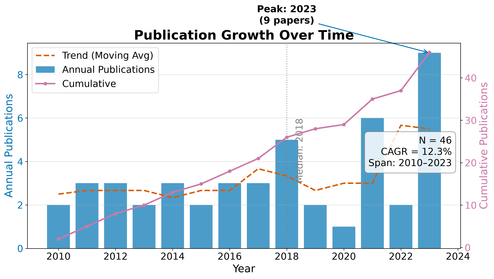{#fig:growth_curve}

## RQ1: Field Size and Growth

The temporal analysis describes a retained literature slice spanning 13
years. The compound annual growth rate of 12.27\% implies a corpus doubling time
of approximately 1.4 years under the configured retrieval and indexing
conditions. The peak year 2023 contains 9 retained records;
that count may reflect both publication activity and delays or differences in source
indexing, so it should not be interpreted as a causal trend without a live coverage audit.

**Table 1. Top publication years.**

| Year | Publications |
| --- | --- |
| 2010 | 2 |
| 2011 | 3 |
| 2012 | 3 |
| 2013 | 2 |
| 2014 | 3 |
| 2016 | 3 |
| 2017 | 3 |
| 2018 | 5 |
| 2021 | 6 |
| 2023 | 9 |

## RQ2: Subfield Composition

Records distribute across the 4 configured subfields as shown in Table 2,
with **Observational Methods** the largest bucket at 50.0\% of the classified
corpus. The dominance of Observational Methods is a property of the configured taxonomy and
retained corpus. It is not a domain prevalence estimate without a live, source-backed
review and a documented coverage assessment.

**Table 2. Subfield distribution.**

| Subfield | Papers | Share |
| --- | --- | --- |
| Observational Methods | 23 | 50.0% |
| Atmospheric Molecules | 7 | 15.2% |
| Jwst Instruments | 9 | 19.6% |
| Theoretical Modeling | 7 | 15.2% |

<!-- FIGURE: field_summary.png -->
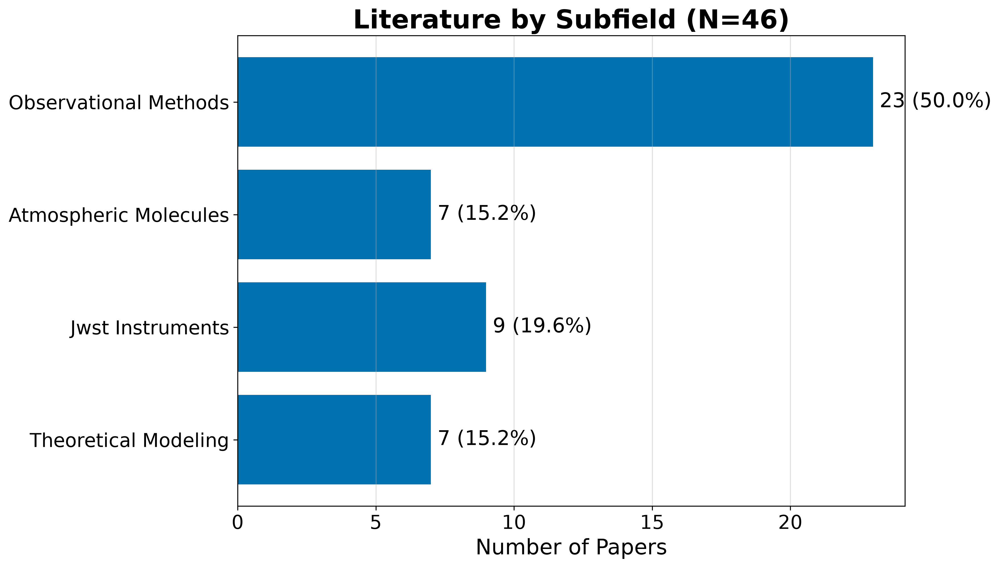{#fig:field_summary}

<!-- FIGURE: subfield_distribution.png -->
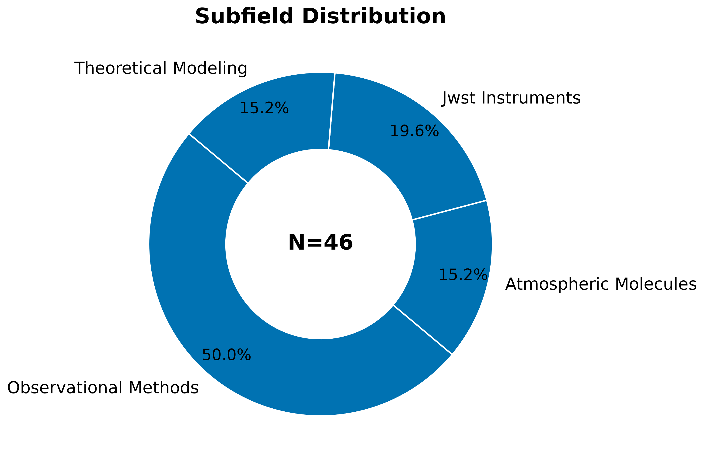{#fig:subfield_distribution}

\newpage

<!-- FIGURE: subfield_timeline.png -->
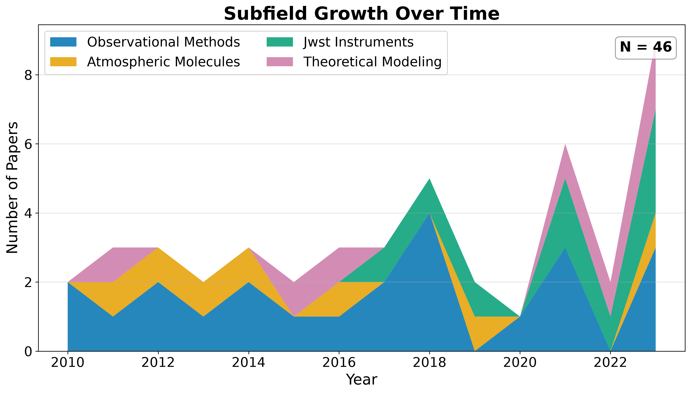{#fig:subfield_timeline}

## Identifier and Full-Text Coverage

The corpus has measurable identifier coverage: 46 of 46 records
(100.0\%) carry DOIs, supporting cross-engine de-duplication.
OpenAlex IDs are present for 5 records. Abstract coverage stands at
100.0\% (46 records), which limits the text analytics
to that subset. Open-access status is confirmed for 43.5\% of records, and
43.5\% have a direct PDF link.

## Descriptive Bibliometrics

The corpus spans 104 unique authors across 46 papers, yielding
a mean of 1.30 papers per author. Citation counts range from zero to
110 (mean 30.0, median 25.0), with a total of
1,381 citations across the corpus. The Gini coefficient of citation
concentration is 0.474. This statistic describes concentration within
the retained corpus and should not be generalized to citation behavior in the field.

**Table 3. Citation count distribution.**

| Citations | Papers |
| --- | --- |
| 0 | 0 |
| 1-9 | 12 |
| 10-49 | 24 |
| 50-99 | 9 |
| 100-499 | 1 |
| 500+ | 0 |

<!-- FIGURE: citation_distribution.png -->
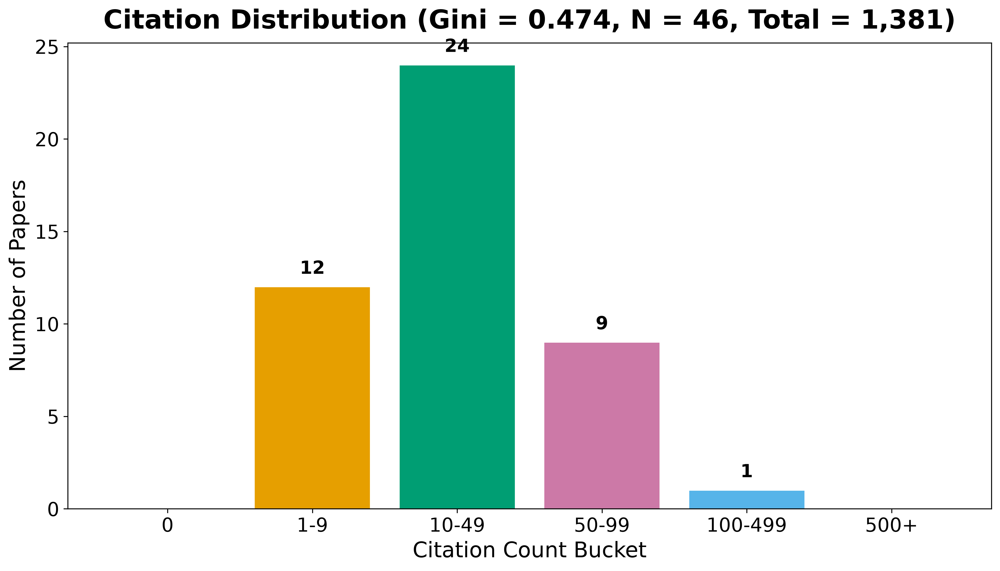{#fig:citation_distribution}

\newpage

**Table 4. Top publication venues.**

| Venue | Papers |
| --- | --- |
| Astronomy and Astrophysics | 8 |
| Monthly Notices of the Royal Astronomical Society | 7 |
| Nature Astronomy | 7 |
| Publications of the Astronomical Society of the Pa | 7 |
| The Astrophysical Journal | 5 |
| Icarus | 4 |
| Research Notes of the AAS | 4 |
| The Astronomical Journal | 4 |

<!-- FIGURE: top_venues.png -->
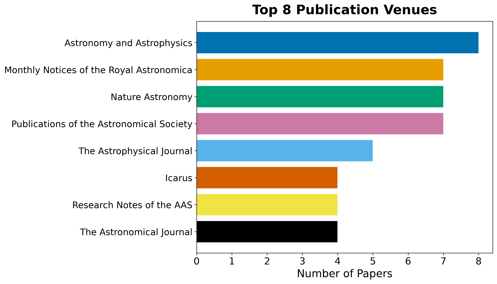{#fig:top_venues}

**Table 5. Top authors by publication count.**

| Rank | Author | Papers |
| --- | --- | --- |
| 1 | D. Ito | 3 |
| 2 | G. Petrov | 3 |
| 3 | J. Ito | 3 |
| 4 | L. Carter | 3 |
| 5 | A. Fournier | 2 |
| 6 | A. Jensen | 2 |
| 7 | A. Singh | 2 |
| 8 | B. Kowalski | 2 |
| 9 | B. Owens | 2 |
| 10 | C. Esposito | 2 |

<!-- FIGURE: author_productivity.png -->
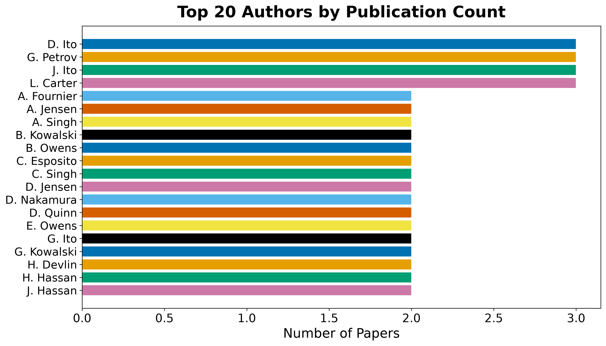{#fig:author_productivity}


---


# Results: Subfield Structure

The subfield taxonomy is configuration-owned. For this instance it contains
4 buckets (Observational Methods, Atmospheric Molecules, Jwst Instruments, and Theoretical Modeling), and each retained record is assigned using
the documented keyword precedence. The resulting distribution is descriptive of the
retrieval slice and should not be read as a prevalence estimate for the complete field.

## Per-subfield characterization

The configured buckets distinguish observational methods, atmospheric molecules, JWST
instrumentation, and theoretical modeling. A fork may add or rename buckets without
changing the analysis code; the taxonomy, keyword lists, and phase relevance should be
reviewed together.

The largest bucket is **Observational Methods** at 50.0%. Table 2 and the
generated subfield artifacts provide the counts and annual breakdown. Where the fixture
corpus is used, these values demonstrate classification behavior only and are marked
synthetic in the evidence registry.

| Subfield | Papers | Share |
| --- | --- | --- |
| Observational Methods | 23 | 50.0% |
| Atmospheric Molecules | 7 | 15.2% |
| Jwst Instruments | 9 | 19.6% |
| Theoretical Modeling | 7 | 15.2% |


---


# Results: Language, Topics, and Embeddings

## RQ3: Topical and Linguistic Structure

Text analysis operates over titles, abstracts, and (when available) full text. A TF-IDF
representation over a 137-feature vocabulary feeds non-negative matrix
factorization, which extracts 5 latent topics cross-cutting the subfield
taxonomy. The top vocabulary terms are: atmospheric, uncertainty, spectra, temperature, abundance, coverage, opacity, sources, analysis, assumptions, observed, retrievals, models, stellar, across, evaluated, retrieval, structure, composition, jwst.

**Table 3. NMF topics extracted from the corpus.**

| Topic | Top terms |
| --- | --- |
| 0 | model, intervals, quantify, effect, noise, misspecification, record, data |
| 1 | population, harmonized, studies, reporting, preprocessing, require, metallicity, variation |
| 2 | atmospheric, abundance, opacity, changes, species, cloud, retrieved, assumptions |
| 3 | jwst, calibration, analyses, choices, reported, extend, characterization, wavelength |
| 4 | signals, instrument, astrophysical, alongside, modelled, systematics, contributions, high |

The topic labels are computed from the retained corpus and are not hand-assigned. Their
interpretation should be checked against the generated topic-term weights and the
configured subfield taxonomy; fixture-derived topics describe synthetic text patterns,
not the scientific field.

<!-- FIGURE: topic_term_bars.png -->
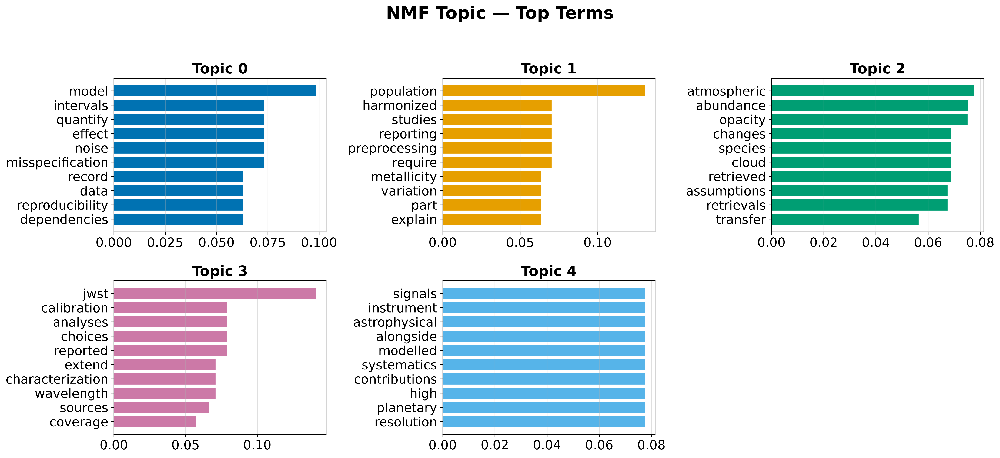{#fig:topic_term_bars}

## Document Embeddings

Offline deterministic embeddings (TF-IDF followed by truncated SVD) place every document
in a shared 50-dimensional vector space. Embedding the same text twice yields identical
vectors, so the derived similarity matrix, nearest-neighbour lists, clusters, and
two-dimensional projection are all reproducible.

<!-- FIGURE: pca_embeddings.png -->
{#fig:pca_embeddings}

<!-- FIGURE: dendrogram.png -->
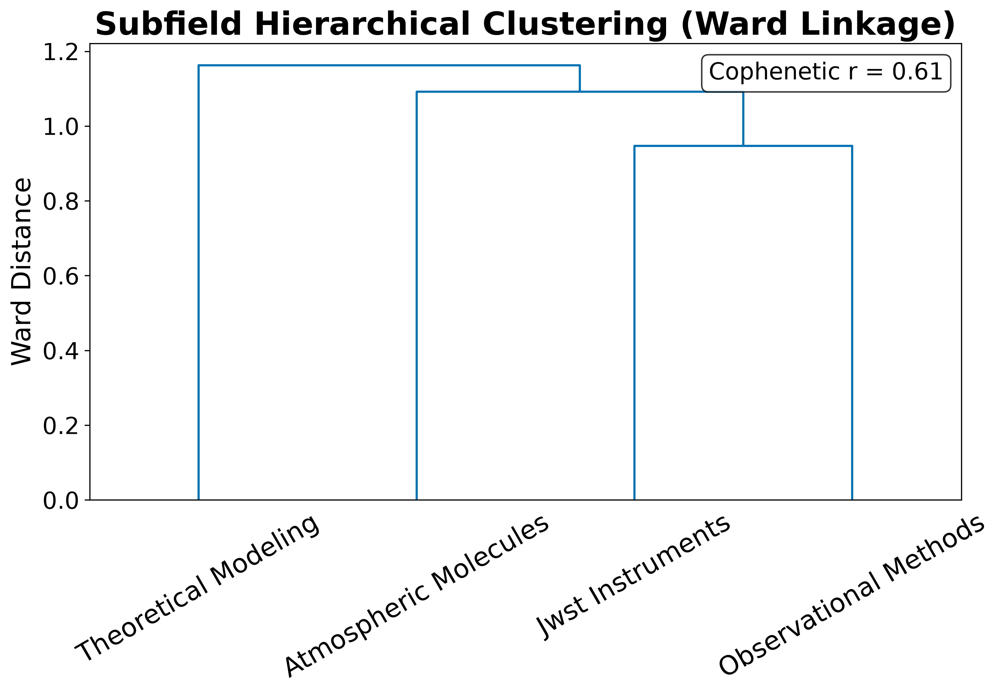{#fig:dendrogram}

## Term Analysis

The TF-IDF term heatmap reveals which terms discriminate between subfields: terms with
high between-subfield variance (rather than high global mean) are selected for display.

<!-- FIGURE: term_heatmap.png -->
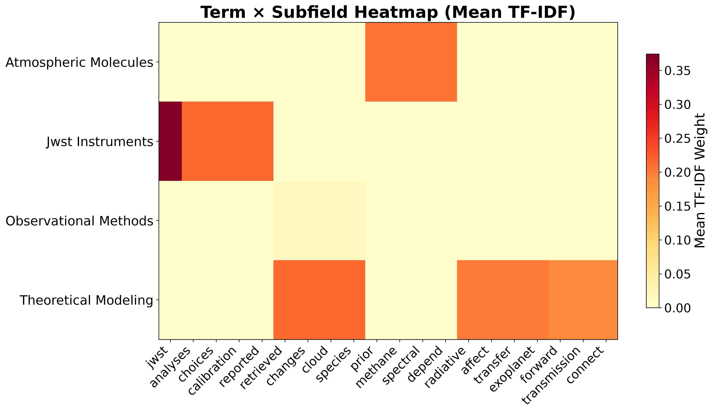{#fig:term_heatmap}

\newpage

## Named Entity Analysis

Named entity extraction over the 46 abstracts identified 1
unique entities. The most frequent entities reflect the retained corpus and the
configured extraction rules; source coverage and fixture status determine how they may
be interpreted.

**Table 4. Top named entities in abstracts.**

| Entity | Frequency |
| --- | --- |
| JWST | 15 |

<!-- FIGURE: entity_bar_chart.png -->
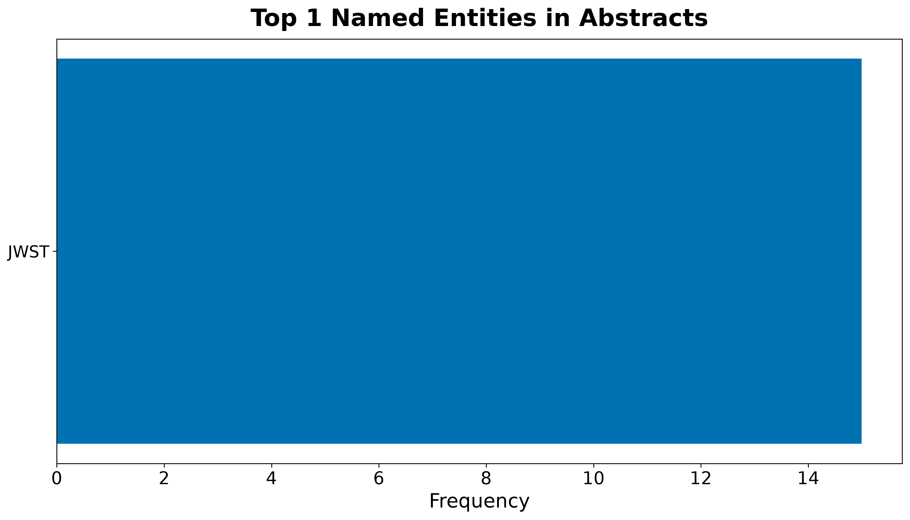{#fig:entity_bar_chart}

\clearpage

**Table 5. Top keyphrases by TF-IDF score.**

| Keyphrase | Score |
| --- | --- |
| jwst | 0.0714 |
| population | 0.0556 |
| analyses | 0.0435 |
| calibration | 0.0435 |
| calibration choices | 0.0435 |
| choices | 0.0435 |
| combined | 0.0435 |
| jwst analyses | 0.0435 |
| models | 0.0435 |
| models calibration | 0.0435 |
| models calibration choices | 0.0435 |
| model | 0.0400 |
| atmospheric | 0.0392 |
| abundance | 0.0385 |
| assumptions | 0.0385 |

## Embedding Similarity and Clustering

The TF-IDF/SVD embeddings place every document in a 50-dimensional vector space. K-means
clustering with $k = 5$ clusters partitions the corpus into
topically coherent groups. The top similar document pairs, ranked by cosine similarity,
reveal the most closely related works in the corpus.

**Table 6. Top 10 most similar document pairs.**

| Paper A | Paper B | Similarity |
| --- | --- | --- |
| doi:10.5555/exoplanet atmosphe | doi:10.5555/exoplanet atmosphe | 1.0000 |
| doi:10.5555/exoplanet atmosphe | doi:10.5555/exoplanet atmosphe | 1.0000 |
| doi:10.5555/exoplanet atmosphe | doi:10.5555/exoplanet atmosphe | 1.0000 |
| doi:10.5555/exoplanet atmosphe | doi:10.5555/exoplanet atmosphe | 1.0000 |
| doi:10.5555/exoplanet atmosphe | doi:10.5555/exoplanet atmosphe | 1.0000 |
| doi:10.5555/exoplanet atmosphe | doi:10.5555/exoplanet atmosphe | 1.0000 |
| doi:10.5555/exoplanet atmosphe | doi:10.5555/exoplanet atmosphe | 1.0000 |
| doi:10.5555/exoplanet atmosphe | doi:10.5555/exoplanet atmosphe | 1.0000 |
| doi:10.5555/exoplanet atmosphe | doi:10.5555/exoplanet atmosphe | 1.0000 |
| doi:10.5555/exoplanet atmosphe | doi:10.5555/exoplanet atmosphe | 1.0000 |

<!-- FIGURE: similarity_heatmap.png -->
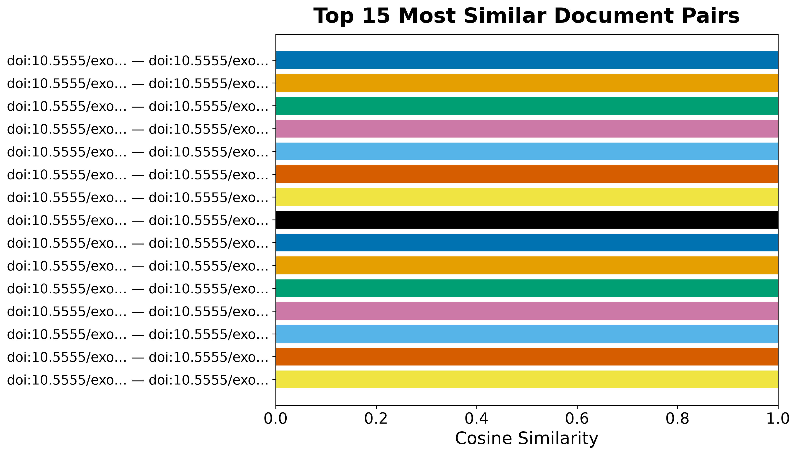{#fig:similarity_heatmap}

<!-- FIGURE: word_cloud.png -->
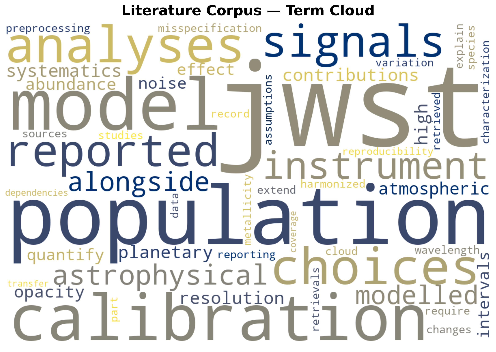{#fig:word_cloud}

<!-- FIGURE: cooccurrence_matrix.png -->
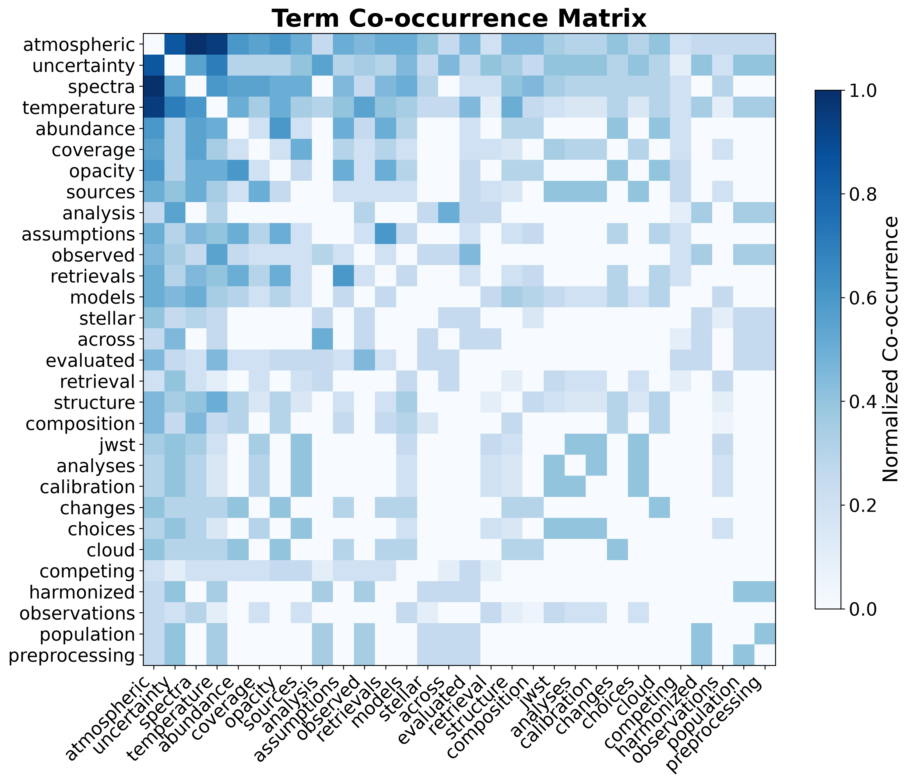{#fig:cooccurrence_matrix}

These embeddings support semantic retrieval over the corpus and the visual map of the
literature's topical geography.


---


# Results: Citation Network

## RQ4: Citation Geometry

Resolving each record's references against the corpus yields an intra-corpus citation
graph (built and analyzed with NetworkX [@hagberg2008exploring]) of 46
nodes and 48 edges across 10 connected components,
with a graph density of 2.32\% and a mean in-degree of
1.0. Of 96 total outgoing references,
50.0\% resolve to another record inside the corpus. This
resolution rate describes how self-contained the retrieved slice is; it is not an
estimate of the underlying citation density of any individual work.

The citation network has 15 communities (detected by modularity
optimization), a maximum in-degree of 6 (the most-cited paper
within the corpus), and a maximum out-degree of 4 (the paper
that cites the most other corpus members).

## Centrality Analysis

Centrality scores (PageRank [@page1999pagerank] and HITS) and modularity-based community
detection [@clauset2004finding] are rounded and ranked with a stable tiebreaker so the
reported hub and authority rankings are byte-reproducible across runs despite the
floating-point non-associativity of the underlying iterative solvers.

**Table 4. Top 5 papers by PageRank.**

| Rank | DOI | PageRank |
| --- | --- | --- |
| 1 | 10.5555/exoplanet atmospheres.0000 | 0.100386 |
| 2 | 10.5555/exoplanet atmospheres.0005 | 0.094693 |
| 3 | 10.5555/exoplanet atmospheres.0008 | 0.089991 |
| 4 | 10.5555/exoplanet atmospheres.0010 | 0.080374 |
| 5 | 10.5555/exoplanet atmospheres.0015 | 0.044154 |

**Table 5. Top 5 authority papers (HITS).**

| Rank | DOI | Authority |
| --- | --- | --- |
| 1 | 10.5555/exoplanet atmospheres.0010 | 0.328136 |
| 2 | 10.5555/exoplanet atmospheres.0016 | 0.117442 |
| 3 | 10.5555/exoplanet atmospheres.0047 | 0.097992 |
| 4 | 10.5555/exoplanet atmospheres.0009 | 0.080540 |
| 5 | 10.5555/exoplanet atmospheres.0015 | 0.076253 |

**Table 6. Top 5 hub papers (HITS).**

| Rank | DOI | Hub |
| --- | --- | --- |
| 1 | 10.5555/exoplanet atmospheres.0057 | 0.126454 |
| 2 | 10.5555/exoplanet atmospheres.0018 | 0.121085 |
| 3 | 10.5555/exoplanet atmospheres.0078 | 0.115800 |
| 4 | 10.5555/exoplanet atmospheres.0056 | 0.111057 |
| 5 | 10.5555/exoplanet atmospheres.0015 | 0.089171 |

The highest-ranked paper by PageRank (DOI 10.5555/exoplanet atmospheres.0000) is a central node in the
retained citation graph. Its score indicates relative centrality within this graph, not
scientific importance or causal influence. Hub papers cite many corpus members and may
connect threads of the retrieved literature, but their role should be checked against
their source type and content.

<!-- FIGURE: citation_network.png -->
{#fig:citation_network}

<!-- FIGURE: degree_distribution.png -->
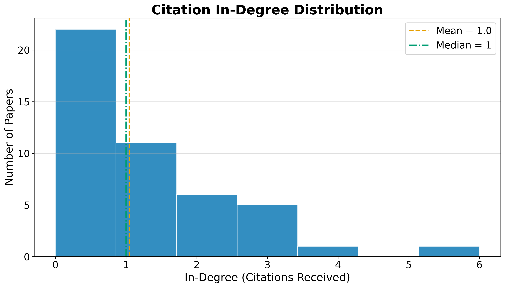{#fig:degree_distribution}

The heavy-tailed degree distribution is characteristic of citation networks: a small
number of highly-cited papers anchor the structure, while the long tail of low-degree
nodes represents newer or peripheral works. The low graph density
(2.32\%) reflects the sparsity of intra-corpus citation links.
Many papers may cite works outside the retrieved slice, especially under a capped
retrieval design.

## Advanced Network Metrics

Beyond PageRank and HITS, the network analysis computes betweenness centrality (which
papers bridge different communities), closeness centrality (which papers are near all
others), degree assortativity (do highly-cited papers cite other highly-cited papers?),
and average clustering coefficient (how tightly knit are local neighborhoods).

The degree assortativity coefficient is -0.0325, and the average
clustering coefficient is 0.0601. A negative assortativity indicates that
highly-cited papers tend to cite less-cited papers (dissortative mixing), which is
typical of citation networks where review papers (high in-degree) cite many primary
studies (low in-degree).

**Table 7. Top 5 papers by betweenness centrality.**

| Rank | DOI | Betweenness |
| --- | --- | --- |
| 1 | 10.5555/exoplanet atmospheres.0010 | 0.021717 |
| 2 | 10.5555/exoplanet atmospheres.0008 | 0.016667 |
| 3 | 10.5555/exoplanet atmospheres.0015 | 0.012879 |
| 4 | 10.5555/exoplanet atmospheres.0005 | 0.010606 |
| 5 | 10.5555/exoplanet atmospheres.0017 | 0.005051 |

Papers with high betweenness centrality occupy shortest paths between communities in
the retained graph. Removing one may alter connectivity, but that graph operation does
not by itself establish that the paper is a review or methodological bridge in the
scientific field. Source-type and content review are required for that interpretation.


---


# Results: Reproducibility Assessment

An optional, **LLM-gated** stage decomposes each paper's described pipeline into a
workflow graph of source, method, experiment, and sink steps, rates how reproducible
each step is from the paper's own text, and combines a content score with a structural
graph-coverage score into one composite reproducibility score per paper (geometric mean,
so a paper cannot buy a high score by being strong on one axis alone). Across
0 scored papers the mean composite score is
pending, with 0 papers falling
below the configured low-score threshold.

## Low-Scoring Papers

Table 8 lists the papers with the lowest composite reproducibility scores, alongside
their content and structural component scores.

**Table 8. Low-scoring papers by composite reproducibility score.**

| Paper | Composite | Content | Structural |
| --- | --- | --- | --- |

## Gating and Defaults

This stage is optional and gated by full-text availability. With no fulltext
available and no language model configured, the stage is skipped and the
reproducibility aggregates read *pending* — the same graceful-degradation convention used by the
knowledge-graph assertion-extraction stage (see
[`02d_methods_knowledge_graph.md`](02d_methods_knowledge_graph.md)). When fulltext is
available and a language model is explicitly configured, the mean score, low-score
count, and per-paper table are populated from extracted workflow graphs. The default
fixture run does not imply that this optional model-backed assessment has occurred.

## Interpretation

A low composite score can reflect either weak content (the paper's own text does not
describe its sources, methods, experiments, or outputs in enough detail to rate highly)
or weak structure (the described steps do not chain into a coherent source-to-sink
pipeline, or reference steps that were never themselves described). The two axes are
reported separately in Table 8 precisely so a low composite score can be diagnosed
rather than treated as a single undifferentiated verdict.


---


# Multi-Phase Results and Cross-Phase Analysis

## Phase-Specific Findings

### Foundation Phase (Phase 1)

The configured foundation phase retained 46 records after its search,
filtering, and de-duplication rules. Its taxonomy includes transit spectroscopy,
emission spectroscopy, phase-curve analysis, and direct imaging. These labels describe
the configured retrieval design; the synthetic fixture cannot establish how widely
those approaches occur in the published literature.

### JWST Phase (Phase 2)

Phase 2 retained 17 records under the JWST-oriented queries and the
configured year filter (≥2020). The boundary is intended to include pre-launch
calibration work and post-launch observations. It is a design choice, not evidence
that the phase is exhaustive or that any instrument caused a change in the field.

### Molecular Detection Phase (Phase 3)

Phase 3 retained 29 records under five configured molecule-oriented
query groups: H₂O, CO₂, CH₄, H₂S, and Na/K. The query groups operationalize the review
question; they do not assert that these are the most commonly detected species or that
the fixture establishes a scientific trend.

## Knowledge Graph Results

The optional knowledge-graph stage reports **pending** assertions from
the eligible sample. The configuration-derived hypothesis table is the authoritative
mapping from review question to score:

| ID | Hypothesis | Scope | Evidence score |
| --- | --- | --- | --- |
| H1 | JWST Atmospheric Characterization | observational | pending |
| H2 | Molecular Diversity Detection | chemical | pending |
| H3 | Cross-Method Consistency | methodological | pending |
| H4 | Theoretical-Observational Agreement | theoretical | pending |

The configured scores are descriptive evidence summaries, not calibrated probabilities,
causal effects, or conclusions about instrument performance. The table should be read
together with the claim ledger and source-tier metadata. A fixture run cannot establish
whether models and observations agree in the broader literature.

## Citation Network Analysis

The combined corpus contains **48** citation relationships
across **46** papers, with a network density of
2.32%. This is a descriptive statistic for the retained
corpus; it does not establish a field-wide citation structure or community claim.

## Reproducibility Assessment

Reproducibility assessment of the sampled papers revealed a mean composite
reproducibility score of pending, with 0
papers successfully scored. This analysis examines the computational workflow
transparency of each paper, evaluating source data availability, method
documentation, experimental reproducibility, and output accessibility.


---


# Discussion

## Interpretation boundary

This pipeline describes the shape of a retrieved literature slice: its phase coverage,
metadata completeness, topic structure, citation links, and declared evidence. It does
not adjudicate scientific truth. Hypothesis scores, when available, summarize recorded
assertions and should be read as evidence-landscape signals rather than calibrated
probabilities.

## Retrieval and phase bias

Engine availability, query wording, rate limits, temporal boundaries, identifier
quality, and full-text access all shape the retained corpus. The retrieval report is the
authoritative account of source outcomes; counts must never be reverse-engineered from
the merged corpus. Phase overlap and cross-phase citation rates are descriptive checks,
not proof that phases are independent or exhaustive.

## Fixture and live modes

The offline path uses reserved synthetic identifiers and generated records. Fixture
outputs validate the machinery and its contracts only. A live review must replace the
fixture, retain source-level provenance, refresh the claim ledger, and obtain domain
review before reporting substantive findings. The manuscript therefore uses explicit
pending and fixture-derived states rather than silently promoting demonstration values.

## Limitations and extensions

- Keyword taxonomies can misclassify ambiguous records; changes belong in configuration
  and should be accompanied by a regenerated classification report.
- TF-IDF/SVD embeddings are lexical and deterministic; transformer-based alternatives
  require an explicit dependency and evaluation decision.
- LLM extraction is optional, model-sensitive, and not a substitute for source review.
- Full-text availability is a coverage measure, not a quality measure.
- Reproducibility claims require a clean double run and normalized artifact comparison.

These limitations are represented as method-stage and review-required findings so a
publication decision can distinguish deterministic failures from editorial judgment.


---


# Conclusion

This exemplar turns a phase-aware literature-review design into an auditable,
reproducible pipeline. It separates retrieval, de-duplication, full-text assessment,
extraction, bibliometrics, knowledge-graph construction, visualization,
reproducibility assessment, and export into independently checkable stages.

The central result is architectural: configuration and recorded artifacts determine the
manuscript, while the claim ledger records what is configured, synthetic, or
source-backed. A deterministic fixture run can prove that the pipeline and validators
work; it cannot establish conclusions about Exoplanet Atmospheres. Live conclusions
require refreshed retrieval evidence, provenance, domain review, and a clean release
audit.

## Reproducibility

The rendered manuscript is generated from `output/data/*.json`, figures, manifests,
registries, and validation reports. A second clean run should match under the
repository’s canonical normalized-diff rules. Any unexplained difference is a release
finding. No generated output should be edited by hand.


---


# Appendix A: Tooling and Reproduction

The pipeline is a two-layer system: generic infrastructure (rendering, validation,
logging) shared across the template monorepo, and project-local `src/` modules that
implement the multi-phase literature review. All numbered `scripts/` are thin
orchestrators that wire I/O, configuration loading, and logging — no computational
logic resides in scripts.

## Reproduce the Offline Default Run

No network, no language model required. The default analysis lane replays the
tracked three-phase evidence snapshot, then runs deterministic analysis, figure
generation, assessment, evaluation, deep-research replay, bibliography export, and
variable injection:

```bash
uv run python projects/templates/template_advanced_literature_review/scripts/01b_fixture_phase_replay.py
uv run python projects/templates/template_advanced_literature_review/scripts/02_meta_analysis_pipeline.py
uv run python projects/templates/template_advanced_literature_review/scripts/04_generate_figures.py --dpi 300
uv run python projects/templates/template_advanced_literature_review/scripts/06_fulltext_assessment.py
uv run python projects/templates/template_advanced_literature_review/scripts/07_literature_evaluation.py
uv run python projects/templates/template_advanced_literature_review/scripts/08_deep_research_dispatch.py
uv run python projects/templates/template_advanced_literature_review/scripts/09_export_bibliography.py
uv run python projects/templates/template_advanced_literature_review/scripts/05_inject_variables.py
```

`scripts/01b_fixture_phase_replay.py` replays the committed corpus through the
phase-provenance contract, writing the per-phase corpora, `phase_metadata.json`,
and `cross_phase_analysis.json` without any network access.

## Reproduce a Live Retrieval Run

Refreshing the evidence snapshot is an intentional live operation. The multi-phase
search stage reads every phase's queries, engines, and filters from
`manuscript/config.yaml` — there is no per-phase command-line surface:

```bash
uv run python projects/templates/template_advanced_literature_review/scripts/01_multi_phase_search.py
```

then re-run the deterministic downstream stages above and re-inject variables so
the manuscript reflects the new evidence. The committed corpus is a dated evidence
snapshot; live claims require source-tier provenance and domain review, per the
project `AGENTS.md` contracts.

## Re-target to Another Topic

Edit `manuscript/config.yaml` — `project_config.search.term`, `query`,
`relevance_keywords`, `subfield_keywords`, `hypothesis_definitions`, and the phase
definitions under `project_config.search_phases` (queries, engines, temporal
filters, `depends_on`) — then regenerate the seed corpus and re-run. No code
changes are required; the manuscript re-targets through token injection.

## Live Retrieval

Enable engines under each phase's `engines` map, supply any optional credentials
(Unpaywall email, Semantic Scholar key), and run `scripts/01_multi_phase_search.py`;
absent engines degrade to skipped sources. Each phase's engine set is configured
independently (the bundled default enables arXiv, OpenAlex, Crossref, and Semantic
Scholar per phase, with biomedical archives disabled for the astronomy domain).

## Deep Research (Offline Fixture Replay)

This exemplar also demonstrates the shared `infrastructure.search.deep_research`
capability — provider-neutral dispatch to OpenAI and Gemini deep-research agents.
Because deep research is a **paid, non-deterministic** service, the template never
calls it live in CI. Instead, `src/deep_research/dispatch.py` wires the
real infrastructure request/result models (`DeepResearchConfig`, `DeepResearchRequest`,
`DeepResearchResult`, `DeepResearchClient`) and ships a deterministic, offline path:
`scripts/08_deep_research_dispatch.py` builds the genuine provider-neutral request and
then *replays* a recorded report fixture
(`src/deep_research/fixtures/recorded_report.json`), normalizing it through the real
`DeepResearchResult` model. Replay fails closed if the fixture is missing — it never
fabricates a passing run — mirroring the fixture-replay idiom of `template_sia`. The
same source module constructs the exact `DeepResearchRequest` a live `submit` would
dispatch, so a fork can enable real providers behind an explicit live-only command:

```bash
# Offline (default): replays the recorded report, no key required
uv run python projects/templates/template_advanced_literature_review/scripts/08_deep_research_dispatch.py
```

## Test Suite

Every project-owned stage is covered by a no-mocks test suite (real computation and
`pytest-httpserver` for network adapters) gated at $\geq 90\%$ coverage on the
project-owned `src/multi_phase/` surface (`pyproject.toml` → `fail_under = 90`).
The suite covers:

- Multi-phase configuration validation (search, sampling, hypotheses, LLM filters)
- Deterministic filters and phase metadata structure
- Cross-phase overlap (Jaccard) and corpus coverage
- Multi-phase search runner and fixture replay contracts
- Phase-aware manuscript variable extraction (including pending/unmeasured states)
- Deep-research offline replay (provider-neutral, fails closed)
- Publication-extension and fixture-honesty contracts

Symlinked shared modules (`src/analysis/`, `src/knowledge_graph/`,
`src/reproducibility/`, `src/visualization/`) are covered by
`template_literature_meta_analysis`'s own suite, not duplicated here.


---


# Appendix B: Technical Notes

## Determinism

All stochastic steps use fixed seeds (seed = 42 for NMF, SVD, and graph layouts). The
fixture corpus, TF-IDF/SVD embeddings, and topic factorization are byte-stable across
runs. Graph centrality scores are rounded to a fixed precision and ranked with a
node-id tiebreaker so that floating-point non-associativity in iterative solvers cannot
perturb the reported rankings. Record identity uses a content digest (SHA-1,
`usedforsecurity=False`) rather than a salted hash, so de-duplication and corpus
byte-stability hold across processes.

## Data Model

Each record is a `Paper` dataclass with: title, abstract, authors (list of `Author`),
year, DOI, arXiv ID, Semantic Scholar ID, OpenAlex ID, venue, citation count, references
(list of canonical IDs), publication date, PDF URL, open-access flag, and full-text
source. The canonical identifier hierarchy governs de-duplication and citation resolution:

$$
\text{canonical\_id} = \begin{cases}
\texttt{doi:} + \text{normalize}(\text{DOI}) & \text{if DOI present} \\
\texttt{arxiv:} + \text{arXiv\_id} & \text{if arXiv ID present} \\
\texttt{s2:} + \text{S2\_id} & \text{if S2 ID present} \\
\texttt{openalex:} + \text{OpenAlex\_id} & \text{if OpenAlex ID present} \\
\texttt{title:} + \text{SHA1}(\text{title})[:16] & \text{otherwise}
\end{cases}
$$

DOI normalization lower-cases the DOI and strips any `https://doi.org/` or `dx.doi.org/`
prefix, so the same paper returned by two engines under different case or format variants
merges to a single canonical ID.

## NMF Mathematics

Non-negative matrix factorization decomposes the TF-IDF document-term matrix
$\mathbf{V} \in \mathbb{R}^{m \times n}$ (where $m$ is the number of documents and $n$ is the
vocabulary size) into $\mathbf{W} \in \mathbb{R}^{m \times k}$ and $\mathbf{H} \in \mathbb{R}^{k \times n}$,
where $k$ is the number of topics (here 5). The factorization minimizes:

$$
\min_{\mathbf{W}, \mathbf{H} \geq 0} \|\mathbf{V} - \mathbf{W} \mathbf{H}\|_F^2
$$

using multiplicative update rules [@lee1999learning] with a fixed random seed for
reproducibility. The topic-term matrix $\mathbf{H}$ gives the top terms per topic; the
document-topic matrix $\mathbf{W}$ gives each document's topic loadings.

## Growth Rate Estimation

The compound annual growth rate is:

$$
\text{CAGR} = \left(\frac{N_{\text{end}}}{N_{\text{start}}}\right)^{1/(T_{\text{end}} - T_{\text{start}})} - 1
$$

where $N_{\text{start}}$ and $N_{\text{end}}$ are the publication counts in the first and
last years of the corpus, respectively. The doubling time is
$t_d = \ln(2) / \ln(1 + \text{CAGR})$. For this run: CAGR = 12.27\%, doubling time
= 1.4 years.

## Configuration Surface

A single `manuscript/config.yaml` controls the search term, per-engine query and keyword
sets, engine enable toggles, subfield taxonomy, hypotheses, full-text and embedding
options, and paper metadata. This run drew on 4 engines, a
4-bucket taxonomy, and 4 hypotheses.

## Artifacts

Intermediate and final outputs live under `output/` and are disposable and regenerable:

| File | Stage | Description |
| --- | --- | --- |
| `corpus.jsonl` | 01 | De-duplicated corpus (46 records) |
| `temporal_analysis.json` | 02 | Year counts, CAGR, doubling time, peak year |
| `subfield_classification.json` | 02 | Per-bucket paper counts |
| `subfield_timeline.json` | 02 | Per-subfield annual breakdown |
| `tfidf_data.json` | 02 | TF-IDF matrix, feature names, doc tokens |
| `topics.json` | 02 | NMF topic-term distributions |
| `citation_network.json` | 02 | Network metrics, PageRank, HITS, communities |
| `citation_graph.gml` | 02 | GraphML citation graph |
| `nanopublications.jsonl` | 03 | LLM-extracted assertions (0 in this run) |
| `hypothesis_scores.json` | 03 | Per-hypothesis evidence scores |
| `cross_phase_analysis.json` | 01 / 03 | Phase membership, overlap, citation sufficiency, and explicit hypothesis-score claim boundary |
| `fulltext_assessment.json` | 06 | Abstract/OA/PDF coverage report |


---


# Appendix C: Accessibility and Provenance

## Figure Accessibility

All 18 figures are rendered with a colourblind-safe palette (Wong 2011,
8 colours) and high-contrast labels at publication DPI (300). Each figure carries a
descriptive caption so the visual claims are recoverable from text alone. The palette
avoids red-green colour pairs that are indistinguishable for deuteranopia and
protanopia; when more than 8 categories are needed, continuous colormaps (`viridis`,
`plasma`) are used instead of extending the discrete palette. Font sizes are enforced at
$\geq 16$pt via a centralized style module, ensuring readability at both screen and print
sizes.

## Provenance Chain

Every reported number is injected from a committed artifact rather than typed by hand;
an unresolved placeholder is a hard error, so the rendered manuscript can contain no
orphaned or stale figures. The configuration hash and artifact inventory bind the prose
to the exact pipeline run that produced it. The provenance chain is:

1. `manuscript/config.yaml` defines the search term, engines, taxonomy, and hypotheses
2. `scripts/01_multi_phase_search.py` retrieves or fixtures records → `corpus.jsonl`
3. `scripts/02_meta_analysis_pipeline.py` analyses the corpus → `*.json` data files
4. `scripts/04_generate_figures.py` renders figures → `*.png` + `figure_registry.json`
5. `scripts/05_inject_variables.py` computes variables from data files → manuscript text

Each figure in `figure_registry.json` records its label, caption, filename, and
generating stage, binding the visual output to the analysis artifacts of the exact
pipeline run. Re-running the pipeline with the same configuration and seed produces
identical data outputs.

## FAIR Data Principles

The pipeline supports FAIR (Findable, Accessible, Interoperable, Reusable) data
principles:

- **Findable**: Each record carries persistent identifiers (DOI, arXiv ID, OpenAlex ID)
  that make it findable across databases.
- **Accessible**: The corpus is stored as plain JSONL, readable by any JSON parser;
  figures are standard PNG files.
- **Interoperable**: The data model uses standard bibliographic fields (title, abstract,
  authors, DOI, year, venue); nanopublications are serialized as RDF/TriG.
- **Reusable**: The entire pipeline is regenerable from `manuscript/config.yaml`;
  re-running with the same configuration reproduces identical outputs.

## Honesty

The default corpus is synthetic and labelled as such; the manuscript does not present
fixture-derived numbers as empirical findings about exoplanet atmospheres. Live findings
require a real retrieval run with regenerated artifacts and source-level provenance.


---


# Glossary

| Term | Meaning |
| --- | --- |
| **Record / Paper** | A single bibliographic entry with metadata and identifiers. |
| **Canonical identifier** | The highest-priority available ID (DOI $>$ arXiv $>$ Semantic Scholar $>$ OpenAlex $>$ title digest) used for de-duplication and citation resolution. |
| **Engine** | An independent literature source adapter (arXiv, OpenAlex, Semantic Scholar, and Crossref) with a uniform search interface and graceful skip-on-failure. |
| **Subfield** | One of the 4 configurable keyword-defined buckets (Observational Methods, Atmospheric Molecules, Jwst Instruments, and Theoretical Modeling) into which records are classified. |
| **Topic** | A latent theme from non-negative matrix factorization over the TF-IDF representation. |
| **Embedding** | A deterministic offline vector (TF-IDF $\rightarrow$ truncated SVD) for a title, abstract, or full text. |
| **Hypothesis** | One of the 4 configured claims about the topic, optionally scored by the knowledge-graph stage. |
| **Assertion** | A directional (supports / contradicts / neutral) statement extracted from a record against a hypothesis, with a confidence score. |
| **Nanopublication** | An RDF-serialized assertion plus its provenance. |
| **CAGR** | Compound annual growth rate of publication volume (12.27\% for this corpus). |
| **Living literature review** | A synthesis that can be re-executed as the field evolves, with every number regenerable. |


---


# References

The bibliography is generated automatically during PDF compilation from `references.bib`.
Every citation key used in the manuscript has a matching bibliography entry, and the
checked-in bibliography contains only sources required by the manuscript sections.
Pandoc's `--natbib` flag injects `\usepackage{natbib}` and
`\bibliographystyle{plainnat}`, so neither directive appears in this section or in
`preamble.md`.

\bibliography{references}

<!--
References management notes:

* Entries are maintained in `references.bib` (BibTeX format).
* Each entry must include `title`, `author` (or `editor`), and `year`.
* DOIs are preferred over URLs where available.
* When adding a new citation, run the integrity sweep documented in `AGENTS.md`
  to confirm a 1:1 match between cited keys and bibliography entries.
-->
